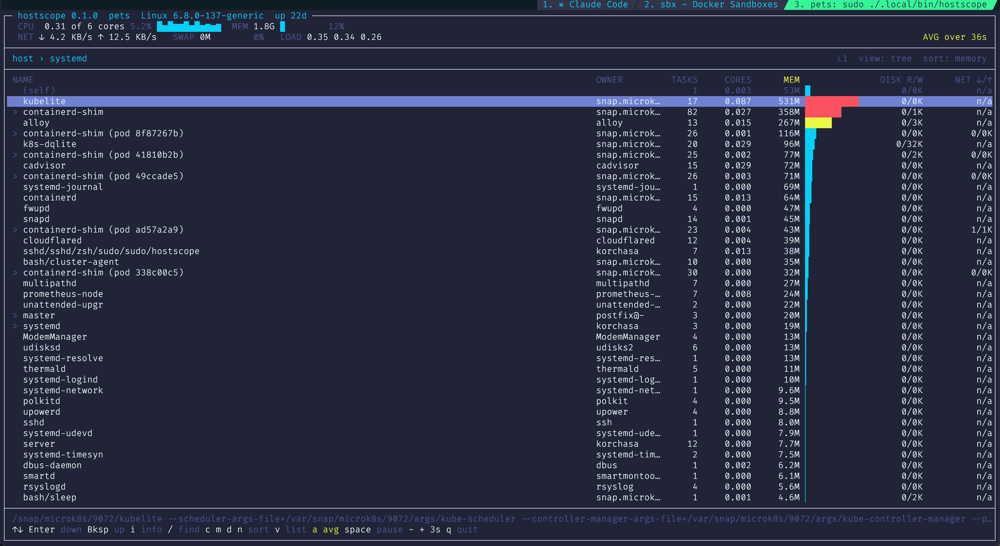

# hostscope

An interactive viewer of the current host state: a tree of resource
usage you can drill into, with container data on the rows that have it.
One static binary, no daemon, no port, read only.

```
HOST=your.host
cargo build --release --target x86_64-unknown-linux-musl && ssh "$HOST" 'mkdir -p /tmp/hostscope' && scp target/x86_64-unknown-linux-musl/release/hostscope "$HOST:/tmp/hostscope/" && ssh -t "$HOST" 'sudo /tmp/hostscope/hostscope'
```

Build, copy, run. The build cross-compiles from any machine that has
the `x86_64-unknown-linux-musl` target, with no musl toolchain and no
Docker: `.cargo/config.toml` links it with `rust-lld`. `ssh -t` matters,
because without a terminal on the other end the application has nothing
to draw on. It also runs without `sudo`, in a reduced form: it marks what
it cannot read as unavailable rather than showing a zero.

## What it shows



```
hostscope - an interactive viewer of the current host state

usage: hostscope [options]

  --tick MS               the interval to start at, in milliseconds
                          (default 3000; - and + move it while running)
  --cgroup-root DIR       read a captured snapshot instead of /sys/fs/cgroup
  --proc-root DIR         read a captured snapshot instead of /proc
  --docker-socket PATH    the docker socket, or 'none' to disable enrichment
  --dump-model json       print the tree model as numbers to stdout and exit
  --dump-frame N          render N frames as text to stdout and exit
  --dump-style N          the same N frames, each followed by a map of the
                          same shape naming the role of every cell: . plain,
                          c calm, u unusual, a alarm, b bar, s selected,
                          m matched
  --keys "Right a Esc"    run a key program and stop
  --size WxH              frame size for --dump-frame (default 100x30)
  --log FILE              write the log to FILE; never to the terminal
  --no-etc-passwd         do not read /etc/passwd; the OWNER column and the
                          card then show the uid instead of the login name
  --theme NAME            the palette to open in: classic, panel, gruvbox,
                          solarized, nord, dracula, tokyo-night, catppuccin
                          (t walks them while running; HOSTSCOPE_THEME sets
                          the one to open in, and --theme out-votes it)
  -h, --help              this text
  -V, --version           version

Dumps go to standard output. FR-10 forbids writing outside the log named on
the command line, and a verification hook is no reason to make an exception.

Besides /proc and /sys/fs/cgroup the application opens one more file for data:
/etc/passwd, once at start, to turn the uid of a login session into the name
the OWNER column shows. It keeps nothing from that file but the number and the
name. --no-etc-passwd leaves it unopened, and the column then shows the number.

The tree is the process forest of the host: every row is a process, and it
stands under the process that started it. What runs a process - a container, a
service, a login session - is read from its cgroup and shown on the row itself,
in the OWNER column. The filter reaches that column as well.

A chain of processes where each one started only the next, all of them with
the same owner, is drawn as one row named for the whole chain. Such a chain
said nothing one level at a time, and cost a keystroke for every level.

A row whose work sits inside a container names that container in parentheses
after its own name: a runtime shim belongs to the container runtime, and the
work is one level below it. A row that leads into several containers of one pod
names the pod instead, by the first group of the pod's identifier.

keys:
  up, down                move
  PageUp, PageDown        move by a screenful
  Enter                   go down; on a row with nothing below, open the card
  Backspace               come back up
  right arrow             also goes down; in the list view it puts a row among
                          its neighbours
  i                       open the card of any row
  /                       filter by name, by command line and by owner
  c m d n                 sort
  v                       lay the level out as a flat list of its ends
  t                       walk the palettes
  a                       switch the measurement window between the average
                          since start and the last interval
  space                   freeze the screen
  - +                     move the refresh interval between a pause, 1, 2, 3,
                          5, 10, 30 and 60 seconds
  Escape                  undo the narrowing nearest at hand: the card, then
                          the filter, then the level
  q                       quit

The bar belongs to the sorted column: it is drawn beside the value the rows
are ordered by, so the longest bar is always on the top row.

CPU is measured in busy cores: 0.5 means half a core is busy, 2.0 means two
cores are.

A figure the machine cannot afford is drawn in another colour, and the row it
sits on is marked in its name column: '!' where something is wrong, '*' where
it is worth a look, and a down arrow where the row is only the way down to the
process that carries it. Every figure is the sum of a subtree, so without that
distinction one busy process would mark every row above it up to the root. The
reading is absolute - a share of what this machine has,
or a state the kernel reports, such as a process left dead or stuck in the
kernel. It is never a comparison against the other rows on screen, so a quiet
machine stays quiet. Disk read and write carry no colour: nothing readable says
what the device underneath can do. The bar keeps comparing the rows of the
level, so a long bar beside a calm figure means large here, not large for this
machine. The card of a marked row says why it is marked: one line per rule that
fired, named after the card row its figure stands on, and naming that figure in
both columns, the whole it was read against and the threshold it crossed.

Eight palettes. 'classic' names the sixteen terminal colours, so the screen
looks the way the reader's own terminal theme draws them. 'panel' fixes the
colours instead - a grey chassis, one orange on the sorted column, and the
selected row as a recessed key. The other six are the terminal schemes their
readers already live in, in their published colours: gruvbox, solarized,
nord, dracula, tokyo-night and catppuccin.
```
## Building

Rust 1.96, and no dependencies beyond `ratatui`, `crossterm` and
`unicode-width` - the last of which `ratatui` already draws with. Build
it statically for the target host, which then needs nothing installed:

```
rustup target add x86_64-unknown-linux-musl
cargo build --release --target x86_64-unknown-linux-musl
```

The result is a 968 KB static binary.

## Checking it

```
make fast                   fmt, clippy and 92 tests, on your machine
make live HOST=your.host    the whole check on a Linux host
```

`make fast` takes seconds and is the step after every edit. `make live`
takes two minutes and needs a host. It ships the binary and the checks in
one trip, walks the interface, compares the model against an independent
oracle, and lints every captured frame. It then raises induced states - a
known CPU quota, a spike against a steady load, a disk load, 200 extra
scopes, vanishing processes, long and non-ASCII names, no Docker socket,
no root - confirms that no process environment is opened and no external
command is run, and cleans up after itself. Everything it creates on the
host is named with the `hs-` prefix.

## Documents

- Requirements: [docs/requirements.md](docs/requirements.md). What the
  application must do, what was measured and where, and every settled
  decision with the reason it was taken and what it rejected.
- How to verify: [docs/testing.md](docs/testing.md). The rigs, the frame
  invariants, the induced states, the figures of the last full run, and
  which check covers which requirement.

## License

Apache License 2.0. The full text is in [LICENSE](LICENSE).
